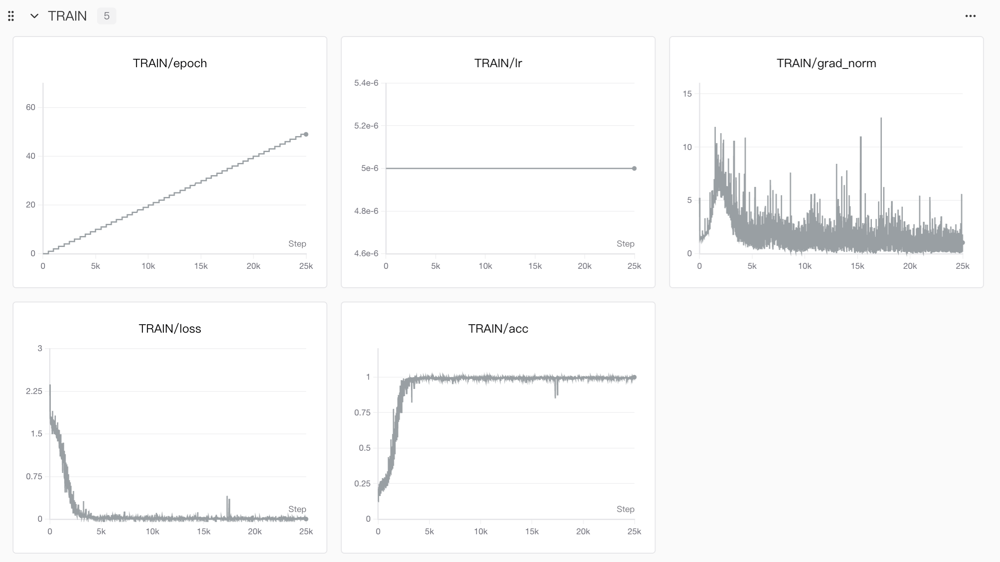
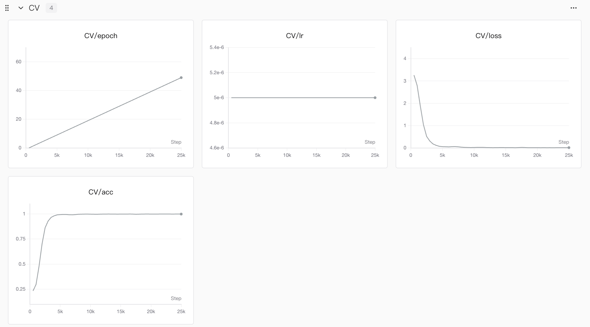
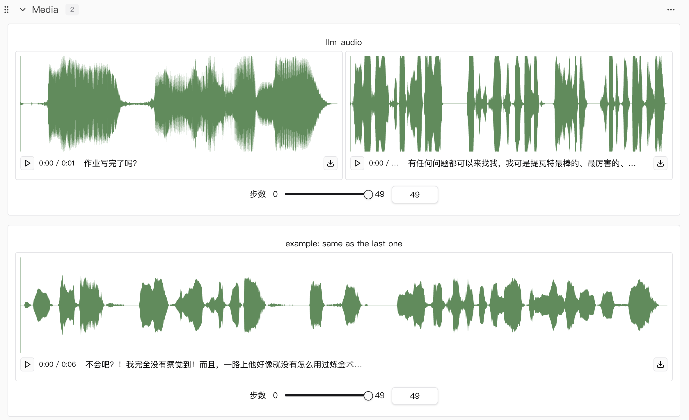
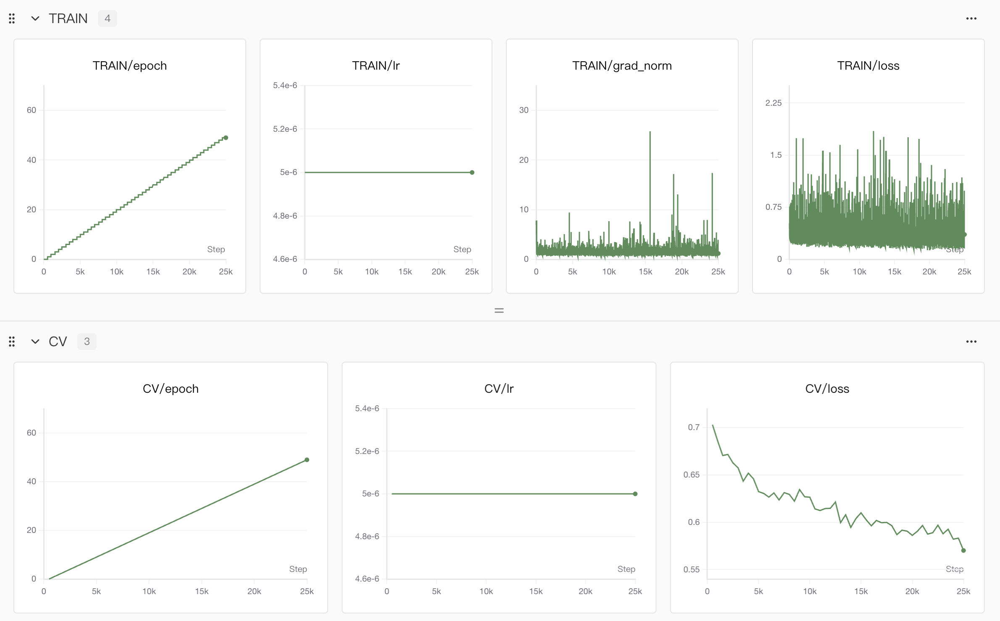
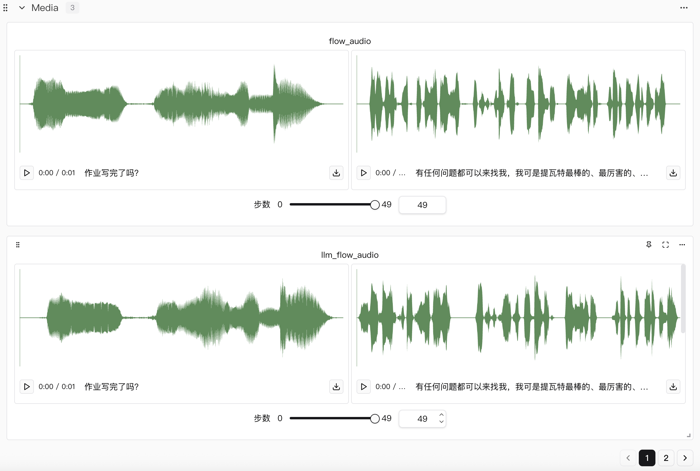

# CosyVoice2 Fine-tuning Paimon's Voice

## Introduction📖

Historically, most of our tutorials have focused on training in the field of natural language processing, and multi-modal work has been primarily image-related. Audio models have rarely been explored. In this tutorial, we will study how to train an audio model.

We have chosen the CosyVoice2 model released by Tongyi Lab to fine-tune Paimon's voice from Genshin Impact. We will provide a very detailed step-by-step guide on how to train CosyVoice. Additionally, the author will share their understanding of the principles behind CosyVoice, which we hope will be helpful to readers.

> Disclaimer: This tutorial is for AI model training purposes only. All datasets are derived from open-source datasets.

**Links to the detailed tutorial and SwanLab observation results are as follows:**

[](https://zhuanlan.zhihu.com/p/1984999416596276696)
[](https://swanlab.cn/@LiXinYu/cosyvoice-sft/overview)

## Environment Installation⚙️

- Clone the code

```bash
git clone --recursive https://github.com/828Tina/cosyvoice-paimon-sft.git
cd cosyvoice-paimon-sft
git submodule update --init --recursive
```

- Install environment

```bash
pip install -r requirements.txt -i https://mirrors.aliyun.com/pypi/simple/ --trusted-host=mirrors.aliyun.com
```

- Requirements:
1. Number of $5090$ GPUs $\ge 2$
2. `Pytorch` $\ge$ 2.7, CUDA version compatible with your system (mine is 12.8)


> If you encounter issues, please refer to the environment installation bug summary in the [tutorial](https://zhuanlan.zhihu.com/p/1984999416596276696).

## Data Processing📊

You need to prepare your dataset in the following format:

```python
├── your data_dir/
│   ├── test/
│   │   ├── 1_1.wav
│   │   ├── 1_1.normalized.txt
│   │   ├── 1_2.wav
│   │   ├── 1_2.normalized.txt
│   │   ├── 1_3.wav
│   │   ├── 1_3.normalized.txt
│   │   └── ...
│   └── train/
│       ├── 1_1.wav
│       ├── 1_1.normalized.txt
│       ├── 1_2.wav
│       ├── 1_2.normalized.txt
│       ├── 1_3.wav
│       ├── 1_3.normalized.txt
│       └── ...
```

`test` and `train` represent the validation set and training set respectively. While these specific names aren't strictly mandatory, they must match the names used in the script `for x in test train; do`.

**Most importantly, the `.wav` and `.normalized.txt` files must correspond exactly; otherwise, gibberish may occur during training.**

Then, modify the stages in `run.sh`:

```bash
stage=0
stop_stage=4
```

Run the following command:

```bash
bash run.sh
```

## Start Training🎬

Configure the hyperparameters according to your needs in `conf/cosyvoice2.yaml`.

Then, modify the stages in `run.sh`:

```bash
stage=5
stop_stage=5
```

Run the following command:

```bash
bash run.sh
```

## Results📈

In this experiment, we trained two models: the `llm` model and the `flow` model. During the training of the `flow` model, in addition to showcasing the standard `flow` model audio effects, we also included the audio effects from the combined weights of both trained `llm` and `flow` models.

You can view the full results and listen online here 👉 [SwanLab](https://swanlab.cn/@LiXinYu/cosyvoice-sft/overview)

**Loss curves and audio results for llm training only**

<div style="display:flex;justify-content:center;">
  <figure style="text-align:center;margin:0;">
    
  </figure>
</div>

<div style="display:flex;justify-content:center;">
  <figure style="text-align:center;margin:0;">
    
  </figure>
</div>

<div style="display:flex;justify-content:center;">
  <figure style="text-align:center;margin:0;">
    
  </figure>
</div>

**Loss curves and audio results for flow training**

<div style="display:flex;justify-content:center;">
  <figure style="text-align:center;margin:0;">
    
  </figure>
</div>

<div style="display:flex;justify-content:center;">
  <figure style="text-align:center;margin:0;">
    
  </figure>
</div>

In these graphs, `Train` represents the training process on the training set, and `CV` can be understood as the forward propagation process performed on the validation set after each `epoch`.

A few points to note⚠️:

1. Accuracy `acc` is only available for the `llm` model, not the `flow` model. This is because the `llm` predicts speech tokens (which can be thought of as IDs in a dictionary) based on input text. Since these are discrete IDs, accuracy can be calculated, which helps improve training effectiveness when combined with loss during backpropagation. The `flow` model theoretically generates the corresponding Mel spectrogram from speech tokens; since this output is non-discrete, accuracy cannot be calculated, leaving only the loss.
2. There is an `llm_flow` effect demonstration in the `flow` results. This is a small modification I made🤏 to allow for a simultaneous comparison between "flow-only fine-tuning" and "both fine-tuned" after the `llm` has been trained, making it easier to observe audio changes in real-time.
3. `example: same as the last one` is a piece of data I randomly selected from the training set as a reference. This was done for readers who may not have played Genshin Impact and are unfamiliar with Paimon's voice.
